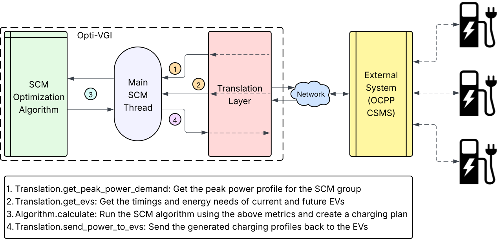

# Opti-VGI: EV Smart Charging Scheduler Application

[](https://github.com/Argonne-National-Laboratory/Opti-VGI/actions/workflows/python.yml)
[](https://badge.fury.io/py/optivgi)
[](https://pypi.org/project/optivgi/)
[](https://argonne-national-laboratory.github.io/Opti-VGI)
[](https://github.com/Argonne-National-Laboratory/Opti-VGI/blob/main/LICENSE)

Opti-VGI is an EV smart charging management application designed to optimize electric vehicle charging based on power or pricing constraints. It provides a flexible framework whose scheduling logic can integrate with Charge Station Management Systems (CSMS). The specific integration method, potentially supporting protocols like OCPP 1.6 or OCPP 2.0.1 / ISO 15118, depends on the implementation of its communication layer.

**Documentation:** [https://argonne-national-laboratory.github.io/Opti-VGI](https://argonne-national-laboratory.github.io/Opti-VGI)

---

## Key Features

*   **Constraint-Based Optimization:** Schedules EV charging considering factors like overall site power limits or dynamic pricing signals.
*   **Modular Architecture:** Clearly separates communication logic (`Translation` layer) from optimization strategies (`Algorithm` layer).
*   **Pluggable Algorithms:** Supports different optimization approaches. Includes implementations like:
    *   `PulpNumericalAlgorithm`: Uses linear programming via the PuLP library.
    *   `GoAlgorithm`: A custom heuristic-based algorithm.
*   **CSMS Integration Interface:** The `Translation` abstract class defines the necessary methods to fetch data (EVs, constraints) and send charging commands, allowing integration with various external systems. The implementation of this layer determines how Opti-VGI communicates (e.g., via API calls, database interaction, or specific protocols like OCPP).
*   **Handles Active & Future EVs:** Considers both currently connected EVs and planned future reservations in its scheduling.
*   **Asynchronous Operation:** Designed to run scheduling logic periodically or in response to events using background worker threads.

---

## Architecture Overview

Opti-VGI follows a modular design:

1.  **Translation Layer (`optivgi.translation`):** An abstract interface (`Translation`) for communication with external systems (e.g., a CSMS). Implementations handle fetching EV data, power constraints, and sending charging profiles. **This is where specific communication protocols (like OCPP methods via a library, or custom API calls) would be implemented.**
2.  **SCM Runner (`optivgi.scm_runner`):** Orchestrates the scheduling cycle, using a `Translation` instance to get inputs, an `Algorithm` instance to calculate schedules, and the `Translation` instance again to dispatch results.
3.  **SCM Algorithm (`optivgi.scm.algorithm`):** An abstract interface (`Algorithm`) for charging strategies. Concrete implementations contain the core optimization logic (e.g., `GoAlgorithm`, `PulpNumericalAlgorithm`).
4.  **EV Data Structure (`optivgi.scm.ev`):** A standard dataclass (`EV`) representing vehicles and their charging parameters.
5.  **Worker Threads (`optivgi.threads`):** Helpers to run the SCM logic periodically or on events without blocking the main application.

### Sequence Diagram



The diagram shows the flow of data and commands between the EVSEs, Opti-VGI, and the CSMS, highlighting the roles of the ``Translation`` and ``Algorithm`` layers in this interaction.
It illustrates how Opti-VGI fetches data from the CSMS, processes it using the selected algorithm, and sends back charging commands.

---

## Installation

You can install the latest stable release from PyPI:

```bash
pip install optivgi
```

For development, clone the repository and install with development dependencies:

```bash
git clone https://github.com/Argonne-National-Laboratory/Opti-VGI.git
cd Opti-VGI
pip install -e ".[dev]"
```

---

## Usage & Examples

Opti-VGI provides the core scheduling framework. To use it, you need to:

1.  **Implement the `Translation` interface:** Create a concrete class that inherits from `optivgi.translation.Translation` and implements the `get_evs`, `get_peak_power_demand`, and `send_power_to_evs` methods to communicate with your specific CSMS or data source.
2.  **Choose an `Algorithm`:** Select one of the provided algorithms (e.g., `GoAlgorithm`, `PulpNumericalAlgorithm`) or implement your own inheriting from `optivgi.scm.algorithm.Algorithm`.
3.  **Run the `scm_worker`:** Use the `optivgi.threads.scm_worker` function in a separate thread, providing your `Translation` implementation and chosen `Algorithm` class. Trigger the worker using an event queue.

An example demonstrating integration via a simple HTTP API and WebSocket notifications can be found in the [`./examples/http-api/`](./examples/http-api/) directory. See the [Examples Documentation](https://argonne-national-laboratory.github.io/Opti-VGI/examples/index.html) for more details.

---

## Contributing

Contributions are welcome! Please feel free to open an issue on the [GitHub Issues](https://github.com/Argonne-National-Laboratory/Opti-VGI/issues) page to report bugs, suggest features, or discuss potential improvements.

---

## License

This project is licensed under the Apache License, Version 2.0. See the [LICENSE](./LICENSE) file for details.

---

## Links

*   **Documentation:** [https://argonne-national-laboratory.github.io/Opti-VGI](https://argonne-national-laboratory.github.io/Opti-VGI)
*   **PyPI Package:** [https://pypi.org/project/optivgi/](https://pypi.org/project/optivgi/)
*   **GitHub Repository:** [https://github.com/Argonne-National-Laboratory/Opti-VGI](https://github.com/Argonne-National-Laboratory/Opti-VGI)
*   **Issue Tracker:** [https://github.com/Argonne-National-Laboratory/Opti-VGI/issues](https://github.com/Argonne-National-Laboratory/Opti-VGI/issues)
