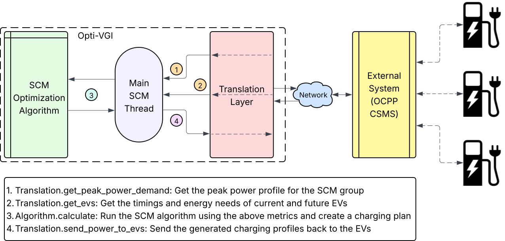

.. optivgi documentation master file

Welcome to Opti-VGI's documentation!
=====================================

Opti-VGI (**Opti**\ mized **V**\ ehicle-\ **G**\ rid **I**\ ntegration) is an EV smart
charging management application designed to calculate and manage optimized
charging schedules for electric vehicles. It focuses on meeting charging needs
while respecting constraints such as:

*   Site-wide peak power limits
*   Time-varying energy prices
*   Individual vehicle requirements (energy needed, departure time)

Its core purpose is to provide the **scheduling logic** that can be integrated into
larger systems.

Key Features
------------

*   **Constraint-Based Optimization:** Schedules EV charging considering factors like overall site power limits or dynamic pricing signals.
*   **Modular Architecture:** Clearly separates communication logic (`Translation` layer) from optimization strategies (`Algorithm` layer).
*   **Pluggable Algorithms:** Supports different optimization approaches. Includes example implementations like `PulpNumericalAlgorithm` (using linear programming) and `GoAlgorithm` (a custom heuristic).
*   **CSMS Integration Interface:** The `Translation` abstract class defines the necessary methods to fetch data (EVs, constraints) and send charging commands, allowing integration with various external systems.
*   **Handles Active & Future EVs:** Considers both currently connected EVs and planned future reservations in its scheduling.
*   **Asynchronous Operation:** Designed to run scheduling logic periodically or in response to events using background worker threads.

Integration with CSMS and Protocols
-----------------------------------
Opti-VGI features a **modular architecture**, separating the optimization strategies (the ``Algorithm`` layer) from the communication with external systems (the ``Translation`` layer). This allows Opti-VGI to be adapted to various backend systems and communication protocols.

By implementing a custom ``Translation`` layer, Opti-VGI can interface with different Charge Station Management Systems (CSMS). This integration could potentially involve standard protocols like **OCPP 1.6** (e.g., using `SetChargingProfile` commands) or leverage **OCPP 2.0.1** features alongside **ISO 15118** for more sophisticated, schedule-based charging. The specific capabilities depend entirely on the design of the target CSMS and the concrete ``Translation`` implementation created to bridge the two systems. Opti-VGI provides the scheduling engine; the method of communication and control depends on the system it connects to via the translation layer.

Sequence Diagram
^^^^^^^^^^^^^^^^

   Sequence diagram illustrating the interaction between Opti-VGI and a CSMS.

The diagram shows the flow of data and commands between the EVSEs, Opti-VGI, and the CSMS, highlighting the roles of the ``Translation`` and ``Algorithm`` layers in this interaction.
It illustrates how Opti-VGI fetches data from the CSMS, processes it using the selected algorithm, and sends back charging commands.

Navigation
==========

.. toctree::
   :maxdepth: 2
   :caption: Contents

   installation
   architecture
   api/index
   examples/index

.. toctree::
	:caption: Links

	GitHub <https://github.com/argonne-vci/Opti-VGI>
	PyPI <https://pypi.org/project/optivgi>
	License <https://github.com/argonne-vci/Opti-VGI/blob/main/LICENSE>

Indices and tables
==================

* :ref:`genindex`
* :ref:`modindex`
* :ref:`search`
